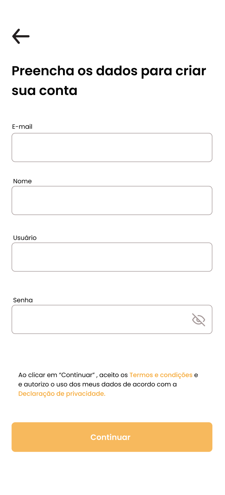
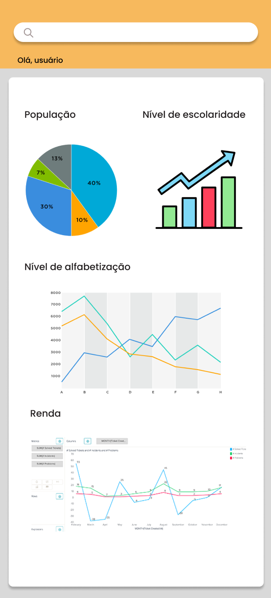
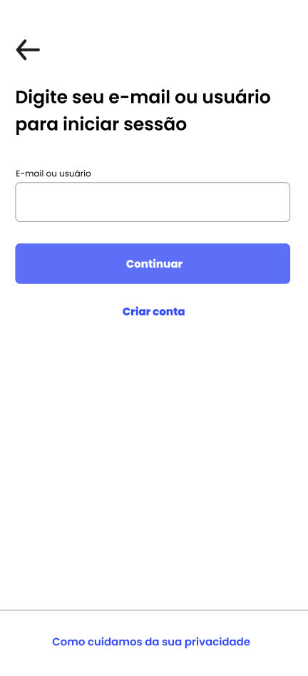
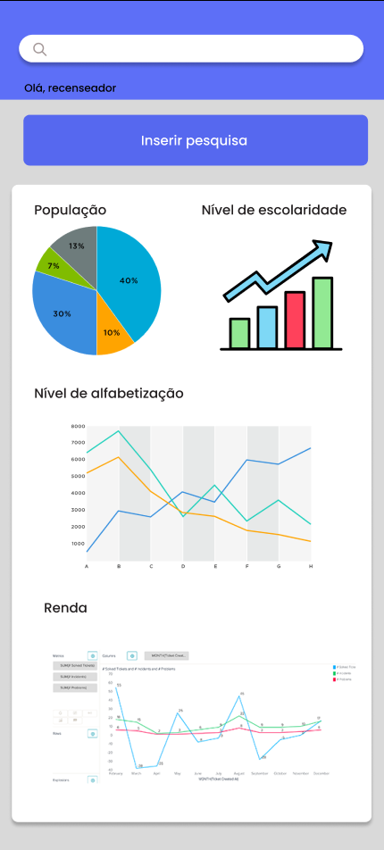

# Protótipo (baixa fidelidade)
## Introdução
 

A construção do protótipo de alta fidelidade auxilia a equipe de desenvolvimento a encontrar um nível de detalhes abrangentes, extrair funcionalidades, testar usabilidade, e também fornece uma base para o gerenciamento do projeto pois com o protótipo é possível realizar estimativas de quanto tempo será necessário desempenhar em cada funcionalidade.

 
## Metodologia
 

Iniciamos o projeto através dos levantamentos iniciais da equipe, após discussões a ferramenta Figma foi selecionada para produzir o protótipo.

 
## Protótipo de alta fidelidade

### Tela Cadastro Usuário

 
### Tela Login Usuário

 
### Tela Dashboard Usuário

 
### Tela Login Adm / Recenseador

 
### Tela Dashboard Adm / Recenseador

## Conclusão

A partir da elaboração do protótipo foi possível ter uma noção inicial da interface do usuário, definindo fluxo, paleta de cores, botões, app bars e diversas outras funcionalidades

 
## Referências
> Ferramenta Figma. Disponível em https://www.figma.com
