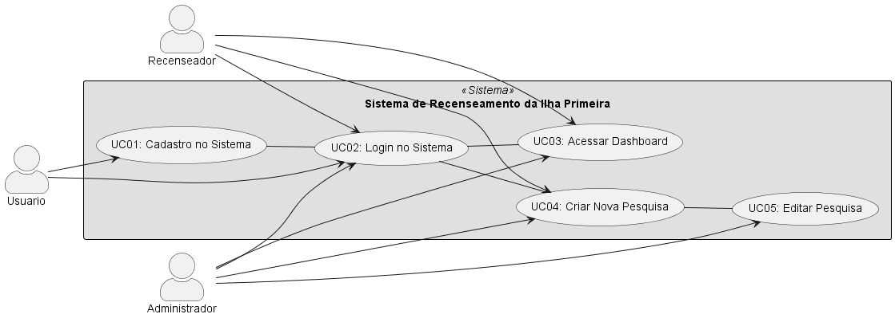

# Casos de Uso - Sistema de Recenseamento da Ilha Primeira

## Caso de Uso 01 - Cadastro no Sistema
**Atores:** Usuário, Sistema

**Pré-condição:** O usuário ainda não possui uma conta cadastrada no sistema.

**Fluxo Principal:**
1. O usuário acessa a página de cadastro.
2. O usuário preenche o formulário com os dados obrigatórios.
3. O usuário envia os dados clicando no botão de cadastro.
4. O sistema valida os dados informados.
5. O sistema cria a conta do usuário e exibe uma mensagem de sucesso.

**Fluxo Alternativo:**
- FA1. Campos obrigatórios não preenchidos → O sistema exibe uma mensagem solicitando o preenchimento dos campos.
- FA2. E-mail já cadastrado → O sistema informa que o e-mail já está em uso e impede o cadastro.
- FA3. Senha fora dos critérios mínimos → O sistema informa os requisitos da senha e solicita uma nova tentativa.

**Pós-condição:** A conta do usuário é criada e o sistema o redireciona para a página de login.

---

## Caso de Uso 02 - Login no Sistema
**Atores:** Usuário, Sistema

**Pré-condição:** O usuário deve estar cadastrado no sistema.

**Fluxo Principal:**
1. O usuário acessa a página de login.
2. O usuário insere seu e-mail e senha.
3. O sistema valida as credenciais.

**Fluxo Alternativo:**
- FA1. Credenciais inválidas → O sistema exibe uma mensagem de erro e solicita uma nova tentativa.

**Pós-condição:** O sistema redireciona o usuário para a página principal.

---

## Caso de Uso 03 - Acessar Dashboard
**Atores:** Usuário, Sistema

**Pré-condição:** O usuário deve estar autenticado no sistema.

**Fluxo Principal:**
1. O usuário acessa a página principal do sistema.
2. O usuário clica no botão "Dashboard".
3. O sistema exibe o dashboard com informações sobre a Ilha Primeira.

**Pós-condição:** O usuário pode visualizar os dados do recenseamento.

---

## Caso de Uso 04 - Criar Nova Pesquisa
**Atores:** Administrador, Recenseador, Sistema

**Pré-condição:** O usuário deve estar autenticado no sistema.

**Fluxo Principal:**
1. O administrador ou recenseador acessa a funcionalidade de nova pesquisa.
2. O sistema exibe um formulário para inserir os dados da pesquisa.
3. O administrador ou recenseador preenche os dados necessários.
4. O administrador ou recenseador confirma e salva a pesquisa.
5. O sistema armazena a pesquisa e atualiza os dados estatísticos.

**Fluxo Alternativo:**
- FA1. Campos obrigatórios não preenchidos → O sistema exibe um alerta e solicita o preenchimento correto.

**Pós-condição:** A pesquisa fica disponível no sistema e pode ser consultada no dashboard.

---

## Caso de Uso 05 - Editar Pesquisa
**Atores:** Administrador, Sistema

**Pré-condição:** O sistema deve ter pelo menos uma pesquisa realizada.

**Fluxo Principal:**
1. O administrador acessa a lista de pesquisas realizadas.
2. O administrador seleciona uma pesquisa para editar.
3. O sistema exibe os dados da pesquisa selecionada.
4. O administrador altera os dados necessários.
5. O administrador confirma as alterações.
6. O sistema salva as alterações e atualiza os dados estatísticos.

**Fluxo Alternativo:**
- FA1. Dados inválidos → O sistema exibe uma mensagem de erro e solicita correção.

**Pós-condição:** A pesquisa é atualizada com sucesso.

---

# Diagrama de Casos de Uso

